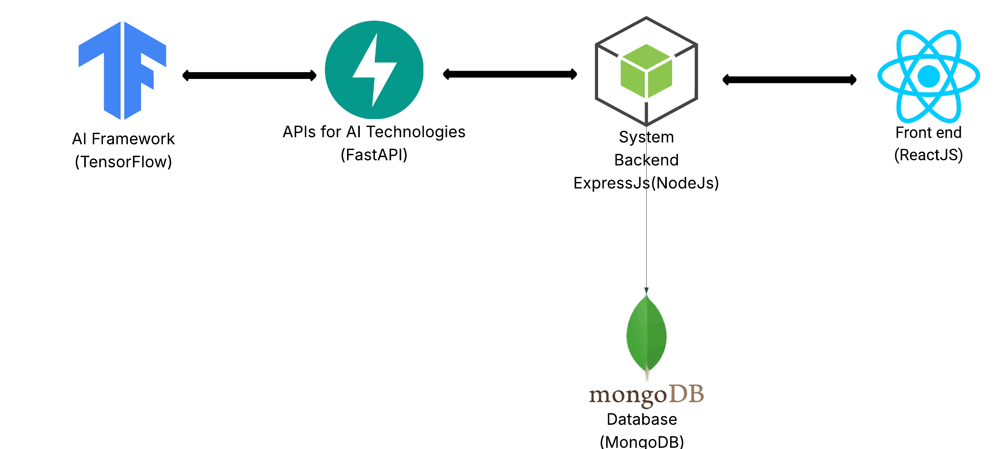

# Iris

## Description about the project
IRIS is an AI-driven diagnostic tool for early detection of diabetic retinopathy using retinal images.  
It leverages an enhanced EfficientNetB4 model trained on the APTOS2019 dataset to classify images into Healthy, Early, and Advanced DR stages.  
With real-time analysis and over 92% accuracy, IRIS supports faster and more accessible screening for medical professionals.

## Iris Architecture

## Repository directory
* Front layer: [Click here](/Frontend)
* Backend layer: [Click here](/BackEnd)

## Credits
* Yazeed Alobidan 
* Faisal Almansour - @BlazeCode1
* Anas Alshehri - @AnasShehri
* Mohammed Alawashez - @Alawashez2
